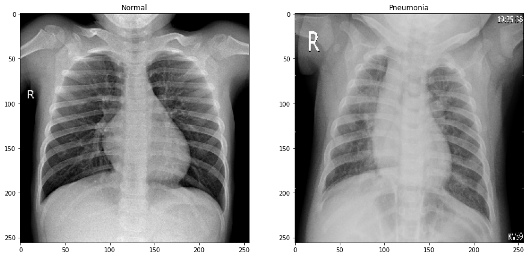
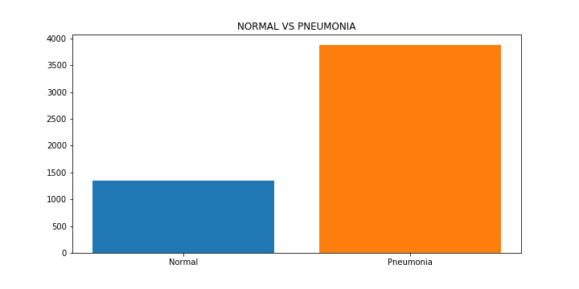
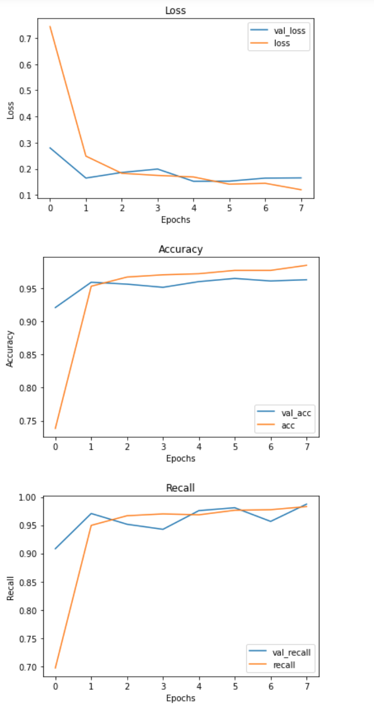
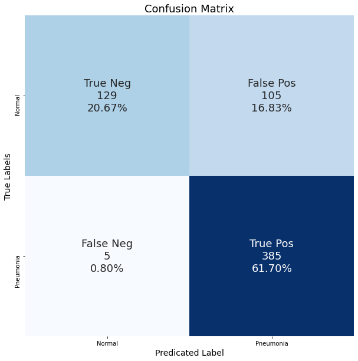
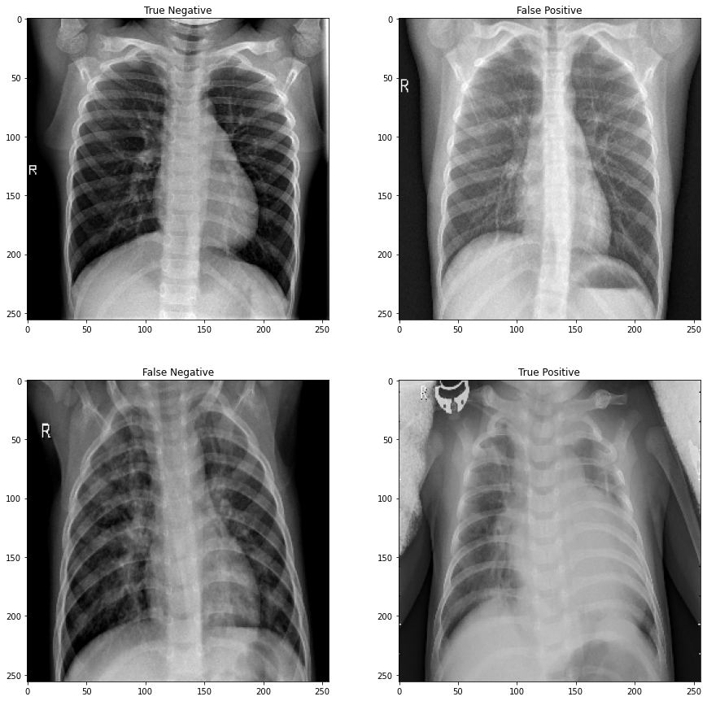

# Pneumonia Image Classification
### Italo Calderon & Wayne Wooyoung Hong

## Structure:
- 01.Exploratory_Data_Analysis.ipynb
- 02.Baseline_Initial_Models.ipynb
- 03.Extra Models.ipynb -- (kaggle) BONUS!
- 04.Final_Models_Analysis.ipynb

### About Dataset:
Dataset was collected from Kermany, Daniel; Zhang, Kang; Goldbaum, Michael (2018), “Large Dataset of Labeled Optical Coherence Tomography (OCT) and Chest X-Ray Images”, Mendeley Data, V3, doi: 10.17632/rscbjbr9sj.3. This dataset consists of chest x-ray photos of patients. 

### What is the Pneumonia? 
Pneumonia is an infection that inflames airsacs in one or both lungs. Symptoms can be dry coughs, chest pain, fever and difficulty breathing. The severity of pneumonia depends on people and can be detected by chest-xray, CT scan, blood tests and etc. As the severity of infection varies, it is crucial to give correct diagnosis to the ill. For adults, pneumonia is the second most common reason for hospital admissions other than giving birth. Roughly 50,000 people out of 1 million people in US die from this disease.

### Exploratory Data Analysis:

This is two chest x-rays that we took just to show comparison. We can see that compared to patients who do not have pneumonia, the x-rays with pneumonia has more foggy, white areas arond heart/lung area. 

Distribution of the classes in the dataset is highly imbalanced where pneumonia x-rays are three times the amount of normal x-rays. We resolved this issue by adjusting the class_weights.

### Modeling:
#### Evaluation Metrics
We will look at Recall as our primary metric score and accuracy as our second score. The reason why we chose recall as our first evalulation metric score is due to lowering False Negatives which refers to when the patients are informed that the x-ray scan test showed that they do not have pneumonia when they do. This can cause fatal issues as pneumonia can be life threatening. That is why we value Recall score. 
Also, we seek for a good accuracy score because we want to be able to be able to predict accurately on the positive cases which means pneumonia so that we are giving correct result to the patients who have tested positive for pneumonia.

#### Normalization:
We normalized our data by rescaling our image pixels by dividing them by 255 to get a value less than 1 and greater than 0. 

#### Optimizers:
We used Stochastic gradient descent(sgd), Adagrad, Adam, and AdamW optimizers with or without amsgrad algorithm to see which would perform best and found out that AdamW w/ amsgrad algorithm performed best.

#### Baseline and Best Model
Our baseline model had a accuracy score of 0.625 and recall score of 1.0.
Our best model had accuracy score of 0.8285 and recall score of 0.9872.

This is our graph of the model on training set and validation set to see how our model is performing. One of the way that we checked whether our model was overfitting or underfitting was by looking at our training loss and validation loss to check. We determined our final model to be this model specifically because even though we saw that it was not as overfitting as other models that we had. We were able to reduce overfitting by using data augmentation, l2 regularization (ridge), and balancing classes.

#### Confusion Matrix:

The confusion matrix we had shows a very low False Negative with only 5 observations and did get a high False Positive, but because we were looking for Recall and Accuracy score, we were content with this model. 

#### Final X-ray samples

We produced our False Negative and False Positive Samples. The reasons why our model might have failed to detect pneumonia is due to photo not having the brightness and correct contrast. Also, when the contrast is bright or more opaque, model have classified as pneumonia case even when they do not have pneumonia. 

#### In the Future

Now that we have alot more False Positives, we can think about how to reduce False Positive so that our model is predicting correctly. We could perhaps collect data about blood test as blood test can reveal pneumonia to combine both ways to classifying pneumonia.
